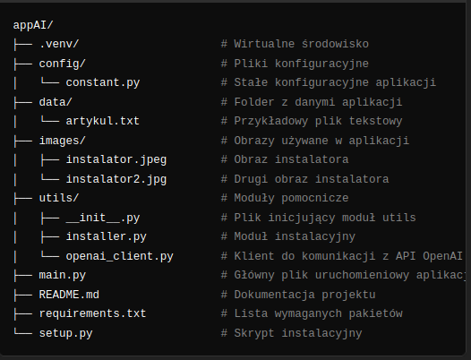

# appAI

## Główne funkcje

- **Automatyczna konfiguracja środowiska:** Wszystkie potrzebne zależności są instalowane automatycznie,
a środowisko wirtualne tworzy się samo.
- **Interfejs graficzny:** Po zakończeniu konfiguracji otwiera się okno graficzne, umożliwiające łatwe korzystanie z funkcji algorytmu.
- **Łatwe zarządzanie zależnościami:** Wymagane pakiety instalują się automatycznie na podstawie pliku requirements.txt.

## Wymagania

    Python: Wersja 3.7 lub wyższa
    pip: Menedżer pakietów Pythona
    Komputer z systemem Windows lub Linux

## Instalacja i Uruchomienie
### Krok 1: Pobranie Repozytorium
Pobierz repozytorium na swój komputer. Możesz je sklonować lub pobrać jako plik ZIP i rozpakować.

### Krok 2: Uruchomienie Skryptu Instalacyjnego

Otwórz terminal i przejdź do katalogu projektu. Następnie uruchom poniższe polecenie, aby automatycznie zainstalować wszystkie zależności i skonfigurować środowisko:

    python setup.py

To polecenie wykona następujące czynności:
- Utworzy wirtualne środowisko .venv, jeśli jeszcze nie istnieje.
- Zainstaluje wszystkie zależności z pliku requirements.txt.
- Skonfiguruje niezbędne zmienne środowiskowe (jeśli są wymagane).

### Krok 3: Automatyczne Uruchomienie Okna Aplikacji

Po zakończeniu instalacji automatycznie otworzy się okno graficzne aplikacji, w którym mogę korzystać z funkcji algorytmu.
Opcjonalne Ręczne Uruchomienie Aplikacji

Jeśli chcę ponownie uruchomić aplikację po zamknięciu, mogę wykonać następujące polecenie:

Dla Linux:

    .venv/bin/python main.py

Dla Windows:

    .venv\Scripts\python main.py

Lub ponownie za pomoca IDE uruchomić plik setup.py

### Struktura Projektu

Dodatkowe Informacje

    Plik .env: Jeśli aplikacja korzysta z klucza API, po pierwszym uruchomieniu poprosi mnie o wprowadzenie klucza i zapisze go w pliku .env.
    Kompatybilność: Skrypt setup.py został skonfigurowany tak, aby działał zarówno na systemach Windows, jak i Linux/Ma